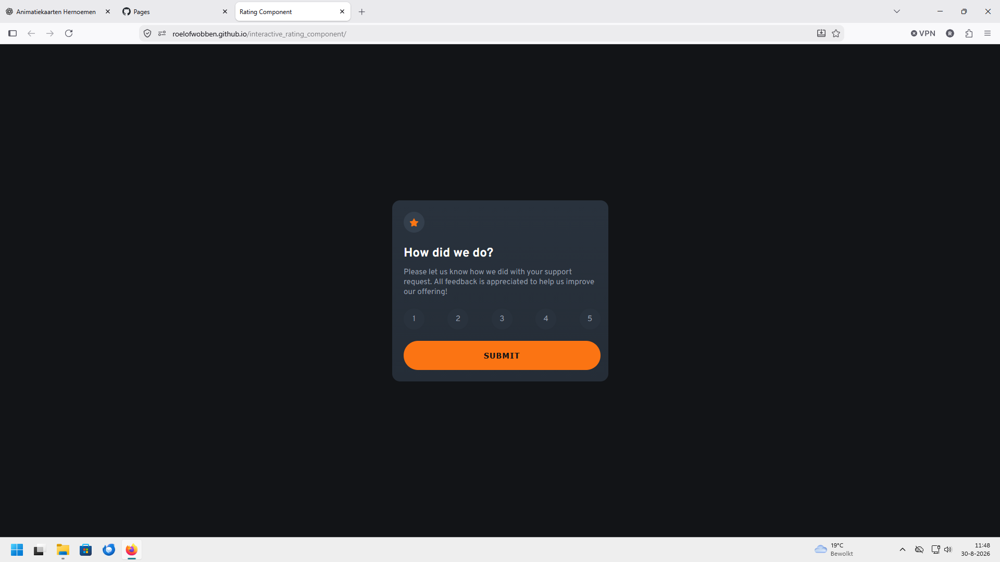
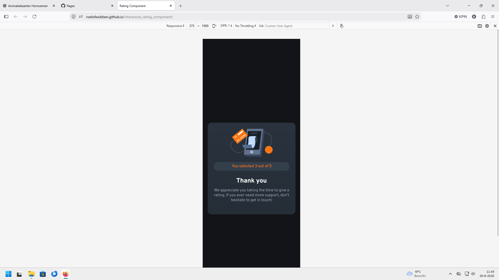

# Frontend Mentor - Interactive rating component solution

This is my solution to the [Interactive rating component challenge on Frontend Mentor](https://www.frontendmentor.io/challenges/interactive-rating-component-koxpeBUmI).

## Table of contents

* [Overview](#overview)

  * [The challenge](#the-challenge)
  * [Screenshot](#screenshot)
  * [Links](#links)
* [My process](#my-process)

  * [Built with](#built-with)
  * [What I learned](#what-i-learned)
  * [Continued development](#continued-development)
  * [Useful resources](#useful-resources)
  * [AI Collaboration](#ai-collaboration)
* [Author](#author)
* [Acknowledgments](#acknowledgments)

## Overview

### The challenge

Users should be able to:

* View the optimal layout for the app depending on their device's screen size
* See hover and focus states for interactive elements
* Select and submit a number rating
* See the "Thank you" card state after submitting a rating
* Navigate the rating options using the keyboard

### Screenshot

#### Desktop

#### Mobile

### Links

* Solution URL: https://github.com/RoelofWobben/interactive_rating_component
* Live Site URL: https://roelofwobben.github.io/interactive_rating_component/

## My process

### Built with

* Semantic HTML5 markup
* CSS custom properties
* Flexbox
* Mobile-first workflow
* Vanilla JavaScript
* CSS transitions and transforms
* Accessibility features such as keyboard focus states and ARIA attributes

### What I learned

This project helped me become more comfortable with JavaScript and DOM manipulation.

I learned how to:

* Select elements from the DOM using `querySelector` and `querySelectorAll`
* Respond to user interaction with `addEventListener`
* Check which radio button has been selected
* Update content dynamically with `textContent`
* Add and remove CSS classes with `classList`
* Create transitions between two different card states
* Manage accessibility when switching between the rating card and the thank-you card
* Add visible keyboard focus states for hidden radio inputs

One of the parts I particularly enjoyed was creating the transition between the two cards instead of simply showing and hiding the thank-you message.

### Continued development

I want to continue improving my JavaScript fundamentals, especially DOM manipulation and managing UI state.

I also want to keep improving my knowledge of accessibility. During this project I learned that making an interface look correct is only part of the work. Keyboard navigation, focus management, semantic HTML and screen reader behaviour also need to be considered.

For future projects I want to think about accessibility earlier in the development process instead of adding it afterwards.

### Useful resources

* [Frontend Mentor](https://www.frontendmentor.io/) - The challenge and its design files provided a great way to practise building a realistic interface.
* [MDN Web Docs](https://developer.mozilla.org/) - Used as a reference for HTML, CSS and JavaScript.
* [Web.dev Accessibility](https://web.dev/learn/accessibility/) - Useful information while working on keyboard navigation and accessibility.

### AI Collaboration

I used ChatGPT as a learning and development assistant during this project.

I used AI mainly for:

* Understanding JavaScript concepts
* Debugging HTML, CSS and JavaScript
* Discussing different approaches to the card transition
* Thinking about accessibility improvements
* Reviewing the project and identifying areas that could be improved

I did not simply copy a complete solution. I worked through the code step by step, tested the changes myself and asked questions when I did not understand why something worked.

One particularly useful part of the collaboration was improving the accessibility of the project. This included adding visible keyboard focus states, using a `fieldset` and `legend` for the rating group, managing `aria-hidden` when switching cards and moving focus to the thank-you heading after submission.

## Author

* Frontend Mentor - [@RoelofWobben](https://www.frontendmentor.io/profile/RoelofWobben)
* GitHub - [@RoelofWobben](https://github.com/RoelofWobben)

## Acknowledgments

Thanks to the Frontend Mentor community and the AI feedback received during the project for pointing out accessibility improvements and areas that could be made more robust.

I learned a lot from building this project and especially enjoyed experimenting with the animated transition between the two cards.
